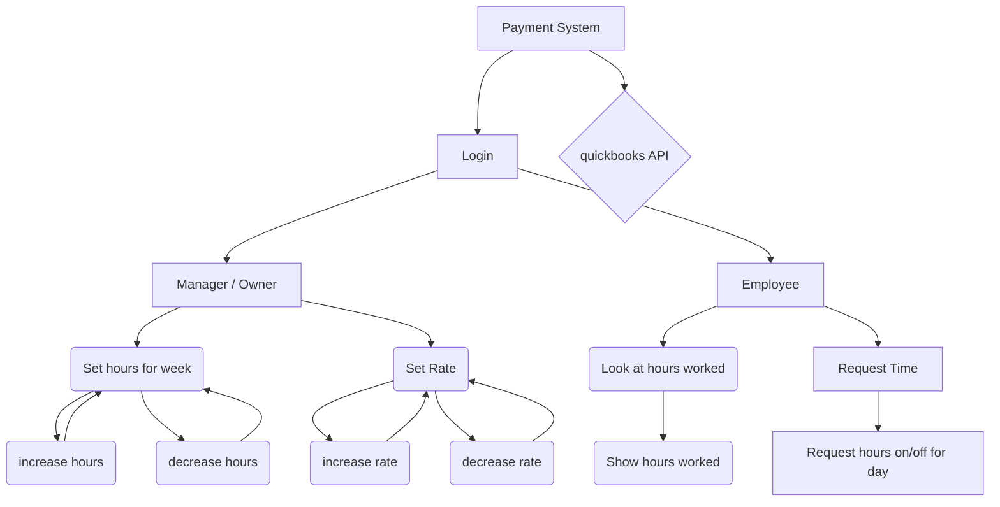
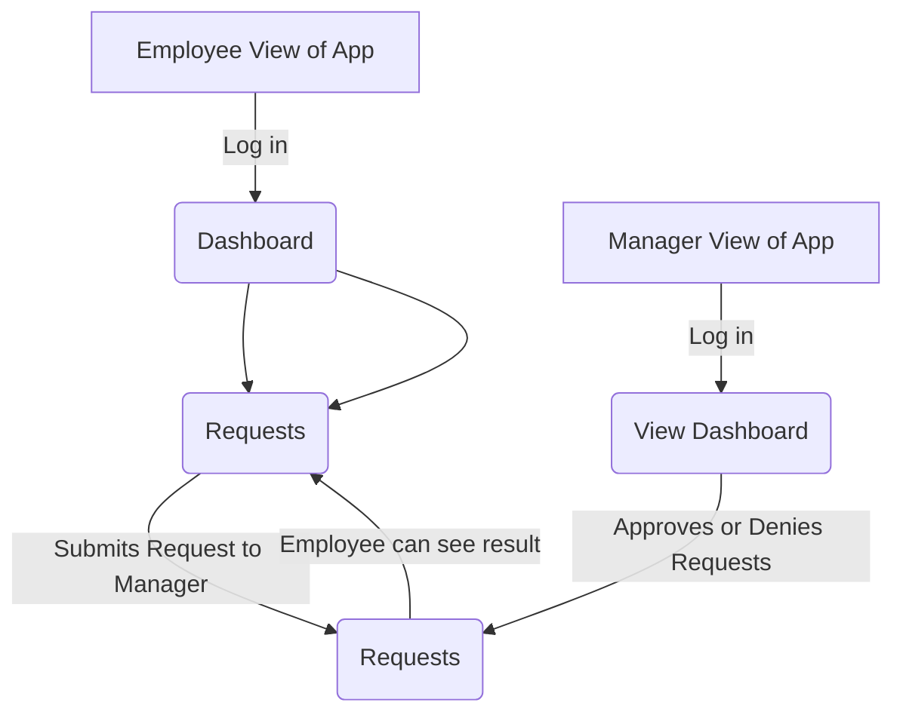
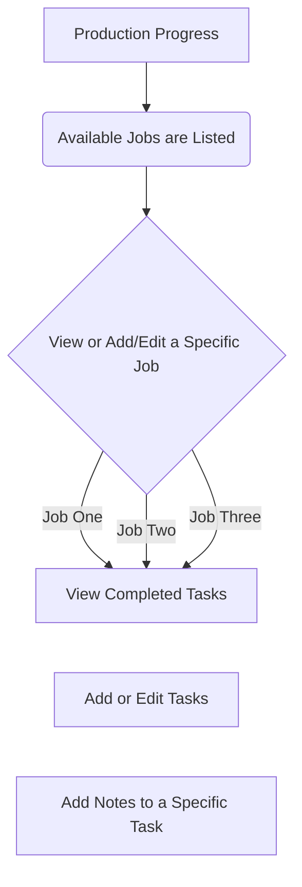

## 📂 Project Overview
/CapstoneMauiProject  
&emsp;├─ CapstoneMauiProject.sln  
&emsp;├─ CapstoneMaui/ &emsp;&emsp;&emsp;&emsp; (MAUI App project)  
&emsp;&emsp;├─ CapstoneMaui.csproj  
&emsp;&emsp;├─ Platforms/  
&emsp;&emsp;&emsp;└─ Android/  
&emsp;&emsp;&emsp;&emsp;└─ Services/  
&emsp;&emsp;&emsp;&emsp;&emsp;└─ AndroidLoggerService.cs  
&emsp;&emsp;├─ Resources/  
&emsp;&emsp;&emsp;├─ AppIcon/  
&emsp;&emsp;&emsp;├─ Splash/  
&emsp;&emsp;&emsp;└─ Images/ Fonts/ Raw/  
&emsp;&emsp;├─ Program.cs / MauiProgram.cs / App.xaml  
&emsp;&emsp;└─ (other app code)  

&emsp;├─ CapstoneMaui.Core/ &emsp;&emsp;&emsp;&emsp; (Shared core library)  
&emsp;&emsp;├─ CapstoneMaui.Core.csproj  
&emsp;&emsp;├─ Components/  
&emsp;&emsp;&emsp;├─ Layout/  
&emsp;&emsp;&emsp;&emsp;└─ MainLayout.razor  
&emsp;&emsp;&emsp;└─ Pages/  
&emsp;&emsp;&emsp;&emsp;├─ Employee/  
&emsp;&emsp;&emsp;&emsp;&emsp;├─ EmployeeDashboard.razor  
&emsp;&emsp;&emsp;&emsp;&emsp;└─ JobSiteMap.razor  
&emsp;&emsp;&emsp;&emsp;├─ Login.razor  
&emsp;&emsp;&emsp;&emsp;└─ Home.razor  
&emsp;&emsp;└─ Services/  
&emsp;&emsp;&emsp;├─ Abstractions/  
&emsp;&emsp;&emsp;&emsp;└─ AbstractLoggerService.cs  
&emsp;&emsp;&emsp;└─ (NotificationService, Auth, etc.)  

&emsp;└─ tests/  
&emsp;&emsp;└─ Unit/  
&emsp;&emsp;&emsp;└─ Unit.csproj  

Relationships:  
&emsp;- CapstoneMaui (app) &emsp;--->&emsp; ProjectReference &emsp;--->&emsp; CapstoneMaui.Core  
&emsp;- CapstoneMaui.csproj references NuGet packages (MudBlazor, Microsoft.Maui.Controls, Microsoft.Extensions.Logging, ...)  
&emsp;- Platform-specific code (Platforms/Android) lives under CapstoneMaui and is compiled only for Android builds.


## Dashboard

Payment System
Use Cases: Manager can set rate of pay. Employee can see how many hours they have totaled so they know what to expect to recieve for their pay. (uses quickbooks API as a backend)


Manager Dashboard + Configuration
Use Case: Manager logs into app for the first time. They are greeted with a dashboard and from here have the option to pick which elements they would like to view on their dashboard. 
```mermaid
flowchart TD
    A[Open App] -->|Log in| B(View Dashboard)
    B --> C(Pick Elements)
    C --> D[Progress]
    C --> E[Jobsites]
    C --> F[Logged Hours]
    C --> H[Requests]
    G(View Progress)
    D --> G
    E --> G
    F --> G
    H --> G
  ```

Employee Dashboard
#clockout only so far
#other dashboard features to be added
Use Case: Employee arrives on site. Employee opens the application in employee mode and clocks in using the clock in feature on their dashboard. The app automatically sends to the database to begin logging the hours. Upon being done for the day, the employee clocks out, which signals to stop logging hours and calculate total hours for the day to log for that day in the database under their name.
```mermaid
flowchart TD
    A[Employee opens Dashboard] --> B{Logged In?}
    B -- No --> C[Redirect to Login Page]
    C --> B
    B -- Yes --> D[View Dashboard]

    D --> E{Clocked In?}
    E -- No --> F{On site?}
    F -- No --> G(Cannot clock in)
    F -- Yes --> H[Status = Clocked in]
    H -- Yes --> I[Begin recording hours]
    

    E -- Yes --> K[Click Clock Out Button]
    K --> L[System records End Time]
    L --> M[Calculate Total Hours]
    M --> N[Status = Clocked Out]
```

Request System
Use Case: Employee logs into app. From their dashboard they elect to submit a request to their manager. Once submitted the manager can either grant or deny the request. The employee is notified of their decision.


Progress Dashboard
Use Case: Manager or Employee arrives on progress dashboard. They can view a list of all active or past jobsites. They will choose a jobsite and then be viewing a list of all tasks associated with that jobsite. They can then choose a task to view more details about it. Tasks can be marked as complete or incomplete. The manager and employee can both add or remove tasks from the jobsite as needed.

