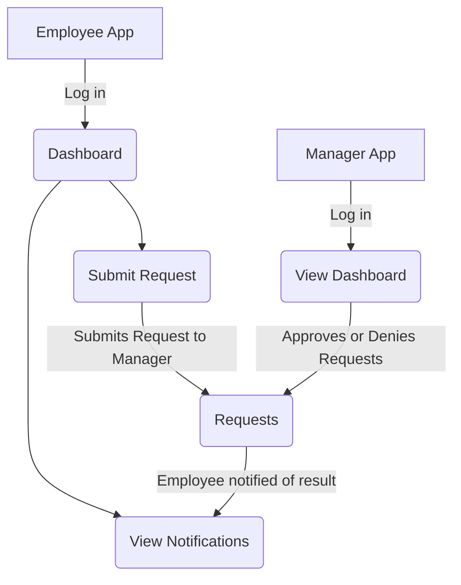

## Dashboard

Manager Dashboard + Configuration
```mermaid
flowchart TD
    A[Open App] -->|Log in| B(View Dashboard)
    B --> C(Pick Elements)
    C --> D[Progress]
    C --> E[Jobsites]
    C --> F[Logged Hours]
    C --> H[Requests]
    G(View Progress)
    D --> G
    E --> G
    F --> G
    H --> G
  ```

Employee Dashboard
#clockout only so far
#other dashboard features to be added
```mermaid
flowchart TD
    A[Employee opens Dashboard] --> B{Logged In?}
    B -- No --> C[Redirect to Login Page]
    C --> B
    B -- Yes --> D[View Dashboard]

    D --> E{Clocked In?}
    E -- No --> F{On site?}
    F -- No --> G(Cannot clock in)
    F -- Yes --> H[Status = Clocked in]
    H -- Yes --> I[Begin recording hours]
    

    E -- Yes --> K[Click Clock Out Button]
    K --> L[System records End Time]
    L --> M[Calculate Total Hours]
    M --> N[Status = Clocked Out]
```

Request System

